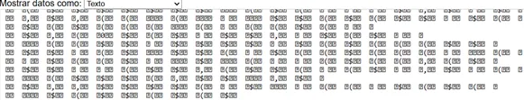

### Capturas:

# Formato Binario: Ventajas, Desventajas y Cálculo de Bytes

## ✅ Ventajas del Formato Binario

- **Ahorro de espacio:** Ocupa menos que el texto en ASCII, ideal para datos grandes o transmisión eficiente.
- **Mayor velocidad:** Lectura y escritura más rápidas, especialmente útil en redes y procesamiento masivo.
- **Precisión numérica:** Evita errores al no convertir entre texto y números.
- **Mayor seguridad:** No es legible para humanos sin herramientas especiales, lo que añade una capa de protección.

## ❌ Desventajas del Formato Binario

- **Difícil de leer:** No puede interpretarse fácilmente sin software específico.
- **Estructura rígida:** Se necesita conocer el formato exacto (orden de bytes, tipos de datos) para entender los datos.
- **Menos compatible:** Puede requerir protocolos específicos para funcionar entre sistemas diferentes.

---

## 📦 ¿Cuántos Bytes se Envían por Mensaje?

Se usa el formato: `'>2h2B'`

- `>` → Big-endian (el byte más significativo se envía primero)
- `2h` → Dos enteros cortos (2 bytes cada uno) → **4 bytes**
- `2B` → Dos enteros sin signo de 1 byte → **2 bytes**

**Total: 6 bytes por mensaje**

---

## 🔢 Representación de Números Positivos y Negativos

- El tipo `h` representa enteros de 16 bits con signo (usa complemento a dos).
- Ejemplos:
  - `xValue = 1000` → `03E8` en hexadecimal
  - `xValue = -1000` → `FC18` en hexadecimal (por complemento a dos)
### Pruebas:

# Diferencias entre ASCII y Binario en el Experimento
## 🆎 Formato ASCII

- **Legible:** Se puede leer fácilmente, por ejemplo: `904,972,False,False`.
- **Más pesado:** Cada número/valor ocupa más espacio al estar en texto.
- **Fácil de depurar:** Puedes ver y entender el contenido en cualquier editor de texto.

## 💾 Formato Binario

- **No legible:** Aparece como caracteres no entendibles (`??␂␂??`).
- **Más compacto:** Ocupa menos espacio y se transmite más rápido.
- **Soporte de negativos:** Puede representar correctamente valores negativos usando complemento a dos.

---

# ✔️ Ventajas y ❌ Desventajas de Cada Formato

## 🔹 Binario

### ✅ Ventajas
- **Eficiente:** Menor tamaño, más rápido de procesar.
- **Preciso:** Sin errores por conversión entre texto y número.
- **Ideal para hardware:** Se adapta bien a protocolos que requieren datos compactos.

### ❌ Desventajas
- **No legible:** Requiere herramientas para interpretar los datos.
- **Difícil de depurar:** No se puede ver el contenido fácilmente.
- **Formato sensible:** Cambios en el orden de bytes (endianness) pueden romper la interpretación.

---

## 🔸 ASCII

### ✅ Ventajas
- **Legibilidad total:** Puede ser leído o editado en cualquier editor de texto.
- **Alta compatibilidad:** Funciona en casi cualquier sistema.
- **Fácil depuración:** Puedes inspeccionar errores rápidamente.

### ❌ Desventajas
- **Ineficiente:** Usa más espacio que el binario.
- **Procesamiento más lento:** Hay que convertir texto a número.
- **Problemas con caracteres especiales:** Algunos símbolos pueden fallar en la transmisión.

